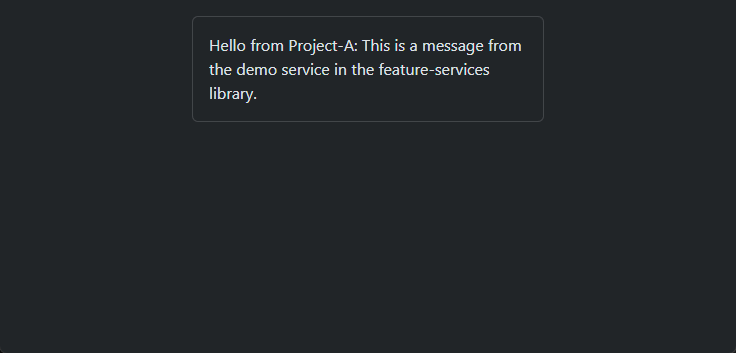

# Nx Monorepo Demo 🧩🔁

Diese Demo zeigt, wie man in einer **Nx Monorepo** eine gemeinsam genutzte Komponente und Services 
in einer Feature-Library erstellt und sie in mehreren Angular-Projekten wiederverwendet. 
Die Architektur basiert auf einer einfachen Trennung in **Apps** und **Libs**.

---

## 🛠️ Verwendete Technologien

- Angular 19
- Nx Monorepo
- Library-Sharing über `libs/features`
- Einfache App-Lib-Architektur
- SCAM (Single Component Angular Modules)

## 📁 Architektur

```
apps/
├── project-a
├── project-b

libs/
└── features/
    └── feature-components
    └── feature-services
```

## 🚀 Lokales Setup

```
git clone https://github.com/ronnymundt/nx-monorepo-demo.git
cd nx-monorepo-demo
npm install
ng serve project-a - Starte die App A
ng serve project-b - Starte die App B
```

## 🎥 Screencast


